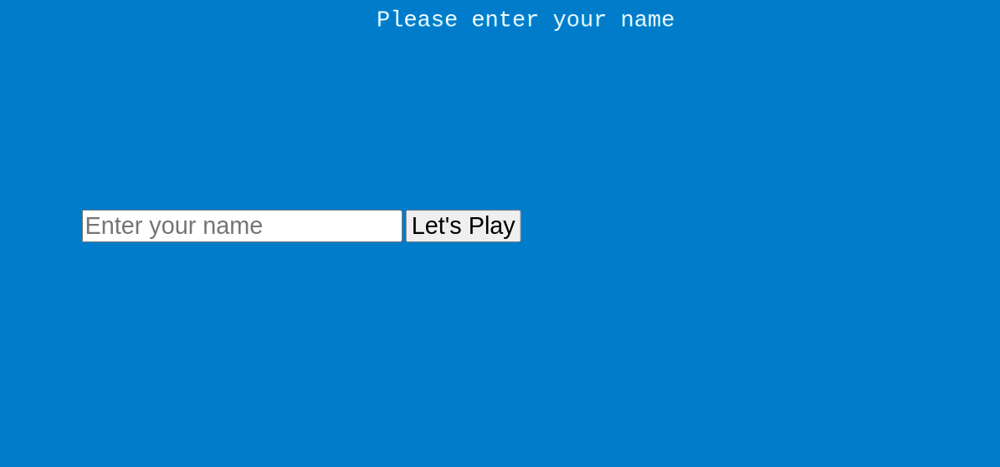
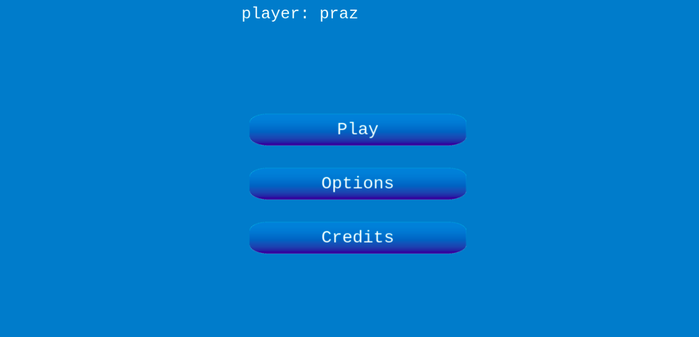
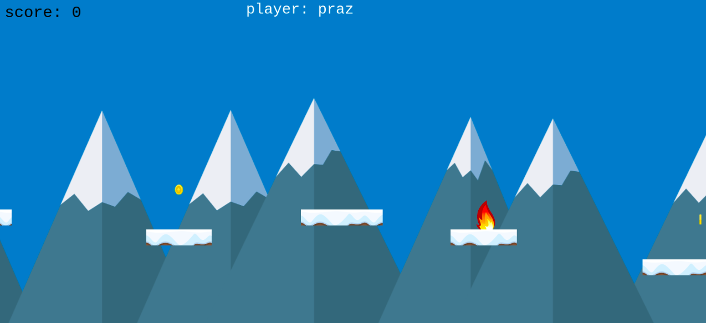
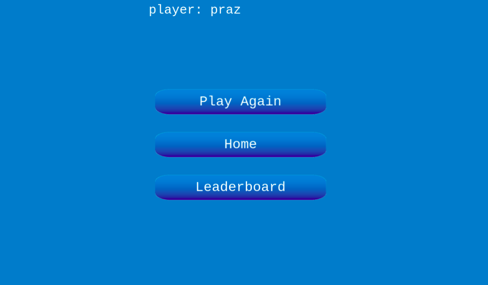
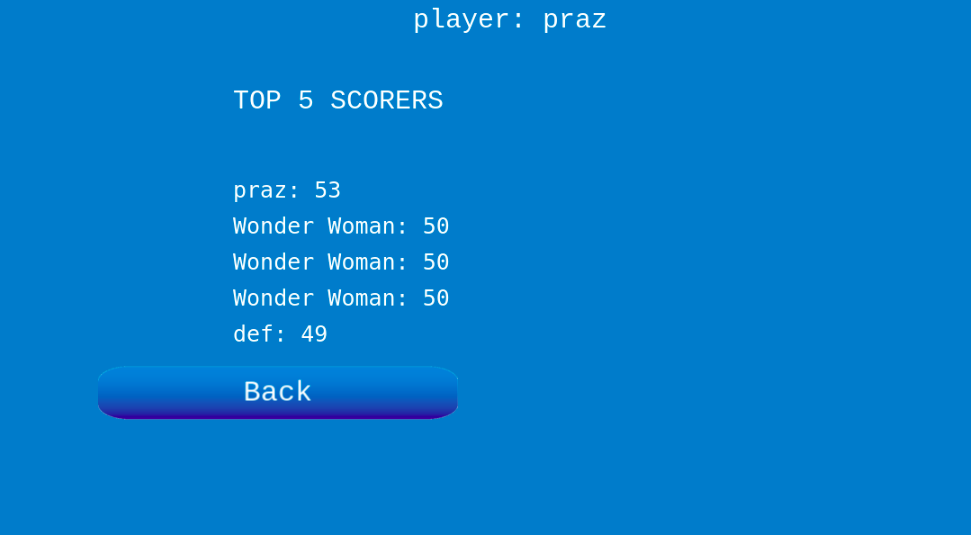

# Platform Game - Runner

>The Runner is an endless runner game where players run over some platforms and jump from ont platform to another.
>The burning fires are presented as obstacles which must be dodged in order to continue the game.
>There are also coins which can be collected to increase the score.  
>The game ends once the user falls down the platform or gets burned by the fire.

> The original specifications for the game requirement can be found [here](https://www.notion.so/Platform-game-4a55a7d1fcc245bcb012c76814764712)

<div align="center">

[](https://github.com/praz99/JS-capstone-platform-game)
[](https://github.com/praz99/JS-capstone-platform-game/issues)
[](https://github.com/praz99/JS-capstone-platform-game/pulls)

</div>

## 📝 Contents

<p align="center">
<a href="#with">Built with</a>&nbsp;&nbsp;&nbsp;|&nbsp;&nbsp;&nbsp;
<a href="#play">Game Instructions</a>&nbsp;&nbsp;&nbsp;|&nbsp;&nbsp;&nbsp;
<a href="#sc">Screenshot</a>&nbsp;&nbsp;&nbsp;|&nbsp;&nbsp;&nbsp;
<a href="#ll">Live Demo Link</a>&nbsp;&nbsp;&nbsp;|&nbsp;&nbsp;&nbsp;
<a href="#gs">Getting started</a>&nbsp;&nbsp;&nbsp;|&nbsp;&nbsp;&nbsp;
<a href="#author">Author</a>
</p>

## 🔧 Built with<a name = "with"></a>

- JavaScript
- Phaser 3
- HTML 5 and CSS 3
- Webpack
- Leaderboard API

## How To Play<a name = "play"></a>

```
The rules are simple
1. Tap or Click to jump.
2. Jump and dodge the fire to stay alive.
3. Jump on the platforms and do not fall down.
4. Collect the coins to increase your score.

```


## Project Screenshot <a name = "sc"></a>












## Live Demo Link <a name = "ll"></a>

[Play Game Here](https://runner-game-praz.netlify.app/)


## Getting Started <a name = "gs"></a>

To get a local copy of the repository please run the following commands on your terminal:

~~~bash
$ git clone git@github.com:praz99/JS-capstone-platform-game.git

~~~

```
$ cd JS-capstone-platform-game
```

## Installing Dependencies

~~~bash

$ npm install

~~~

~~~bash

$ npm run start

~~~

Now visit http://localhost:8000/ in your browser.

## For Testing
This project has been tested using [Jest](https://jestjs.io/en/) Framework.  
To start testing, enter the following command

~~~bash

$ npm test

~~~

## Game Development
>The Game Design Document for this project can be found [here](assets/docs/GDD.md)

## ✒️  Authors <a name = "author"></a>


👤 **Prajwal Thapa**

- Github: [praz99](https://github.com/praz99)
- Twitter: [@thapa_praz](https://twitter.com/thapa_praz)
- LinkedIn: [prazwal-thapa](https://linkedin.com/in/prazwal-thapa)
- Email: t.prazwal@gmail.com

## 🤝 Contributing

Contributions, issues and feature requests are welcome!

Feel free to check the [issues page](https://github.com/praz99/JS-capstone-platform-game/issues).


## 👍 Show your support

Give a ⭐️ if you like this project!

## :clap: Acknowledgements

- [Microverse](https://www.microverse.org/)
- [Phaser](https://phaser.io/)
- [OpenGameArt](https://opengameart.org/)
- [Game Art 2D](https://www.gameart2d.com/freebies.html)

## 📝 License

This project is [MIT](./LICENSE) licensed.